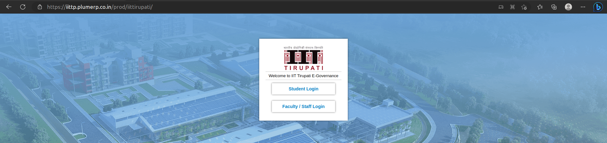

# Requesting an account

You must use [ERP](https://iittp.plumerp.co.in/prod/iittirupati/){:target="_blank"} to request an account. Our team will create an account for you and share the details there.

##Steps are shown below:

* Go to https://iittp.plumerp.co.in/prod/iittirupati/
  
* Login into ERP either as a Student or as a Faculty/Staff using your User ID and Password
* Once you login, click on the hamburger icon to the top left for navigation menu 
* Select **SERVICES** in the Menu and then "Computer Center" as shown in the image below:

* Click on {:style=vertical-align:bottom} at the top right for creating a new ticket.
* A form will be shown to your right. Fill in the General Information in the relevant fields. 
  

    
  

  + Fill the Subject field
  - Pick Nature of Request as 'Systems' from the list
  - Pick Request Type either as 'Lotus Cluster/New account request' or 'Orchid Cluster/ New account request'
  - Now, in the Request Details add the following:
    + your Project Incharge/Guide Name
    - your project description
    - other details, if any   

* Any attachments may be uploaded by clicking on the attachments tab indicated by {:style=vertical-align:bottom}
* Click on the {:style=vertical-align:bottom} to submit the request. 
