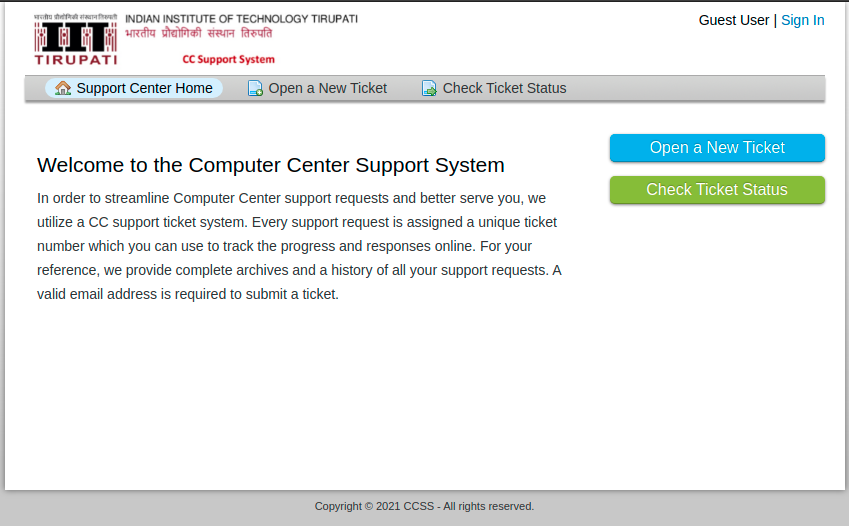

# Requesting an account

You must use [CCSS](https://ccss.iittp.ac.in){:target="_blank"} to request an account. Our team will create an account for you and share the details there.

##Steps are shown below:

* Go to https://ccss.iittp.ac.in
  
* Click on {:style=vertical-align:bottom} link available in the menu bar or to the right.
* Click on **Sign in with Google** button
* Select institute email account or enter your username and password
* Once you login, select **Systems** in the Help Topic
<p align="center">

</p>

* From the **Select Support Category** dropdown menu, select either ```Lotus Cluster/New account request``` or ```Orchid Cluster/New account request```
<p align="center">
  
</p>
* Now, add the subject
* In the request summary add the following:
    + your Project Incharge/Guide Name
    - your project description
    - other details, if any
* Carefully choose **Priority Level** from the menu. We prefer it as ```Normal``` unless necessary.
* Click on the {:style=vertical-align:bottom} to submit the request. 