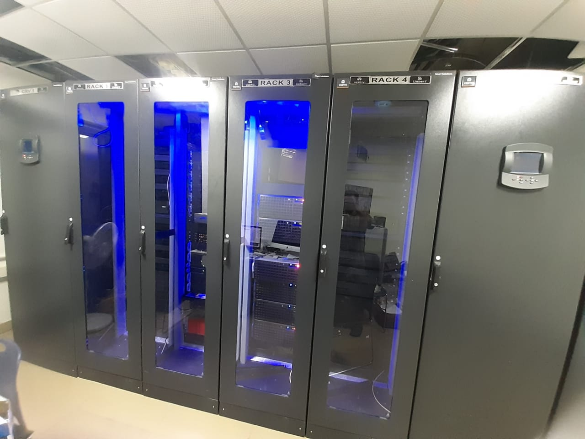
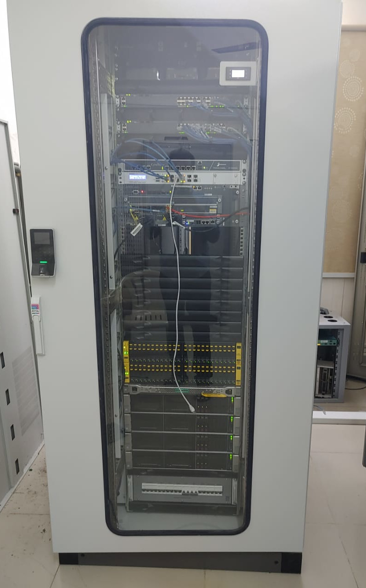
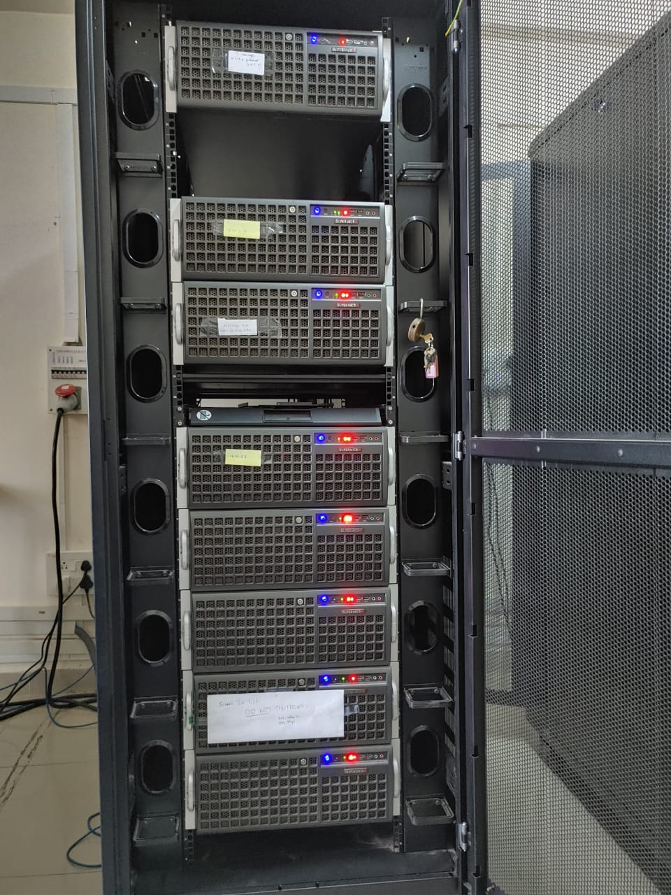
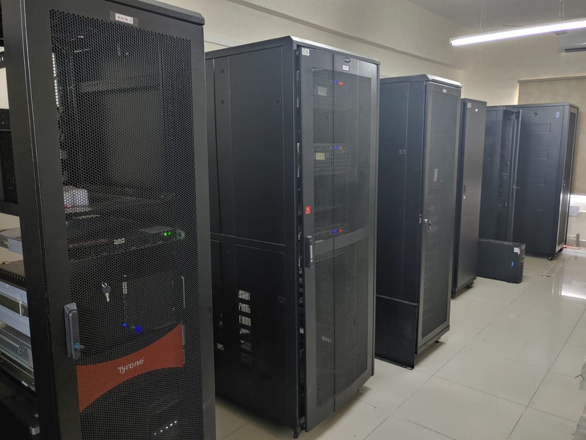

# Welcome

## High Performance Computing at IIT Tirupati
This is the documentation for The Indian Institute of Technology Tirupati’s High Performance Computing (HPC) clusters:

* [Lotus Cluster](lotus/index.md)
* [Orchid Cluster](orchid/index.md)

Run by Computer Center’ Systems vertical and they support the computational needs of faculty and researchers across all departments.

## CC - Systems Vertical
The CC-Systems vertical is responsible for HPC and cloud computing services to the users of the institute. If you require support, the team would be happy to help. Take a look at the [Computer Center](https://cc.iittp.ac.in) website.

<figure style="">
	  
	<figcaption> Lotus and Orchid clusters in smart racks </figcaption>
</figure>

<figure style="display: inline-block;">
    
</figure>

<figure  style="display: inline-block;">
    
</figure>
 <i>Virtualization cluster</i>

<figure style="">
	  
	<figcaption> Project workstation racks </figcaption>
</figure>

